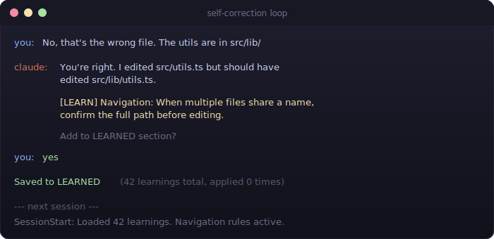
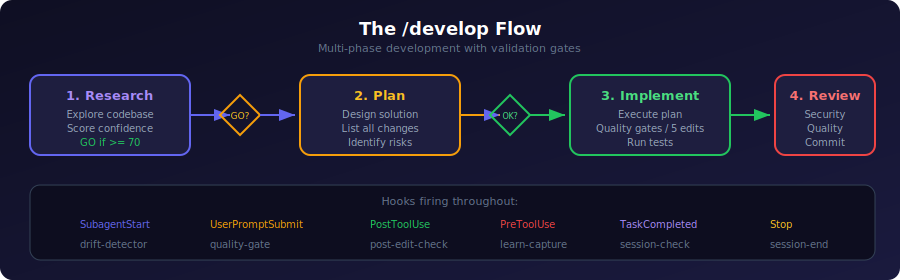
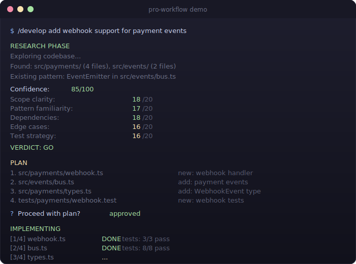
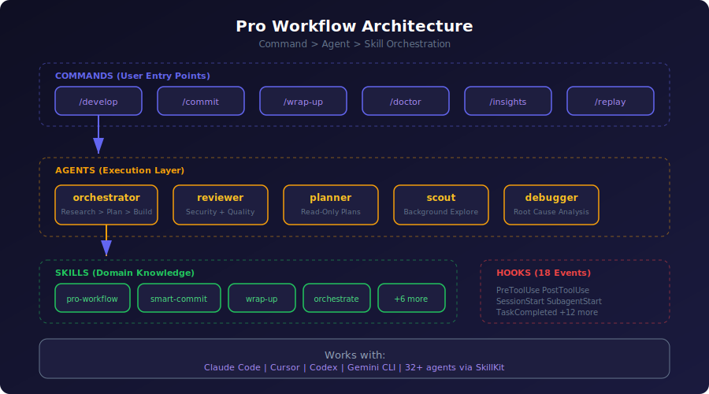
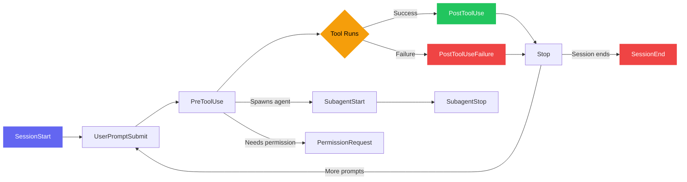
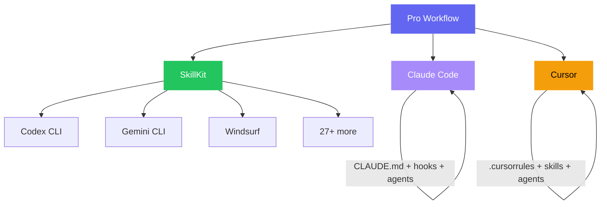

<p align="center">
  
</p>

<p align="center">
  <a href="https://github.com/rohitg00/pro-workflow/stargazers"></a>
  <a href="https://www.npmjs.com/package/pro-workflow"></a>
  <a href="https://github.com/rohitg00/pro-workflow/blob/main/LICENSE"></a>
  <a href="https://agenstskills.com"></a>
</p>

<p align="center">
  <b>Complete AI coding workflow system.</b><br/>
  Orchestration patterns &bull; 18 hook events &bull; 5 agents &bull; 7 reference guides &bull; Cross-agent support<br/>
  Works with <b>Claude Code</b>, <b>Cursor</b>, and <b>32+ agents</b> via SkillKit.
</p>

---

## What's New in v2.0

<table>
<tr><td>Orchestration Patterns</td><td>Command > Agent > Skill architecture with multi-phase development</td></tr>
<tr><td>5 Agents</td><td>planner, reviewer, scout, orchestrator (RPI workflow), debugger</td></tr>
<tr><td>18 Hook Events</td><td>Added SubagentStart/Stop, TaskCompleted, PermissionRequest, TeammateIdle, PostToolUseFailure</td></tr>
<tr><td>7 Reference Guides</td><td>Settings, CLI cheatsheet, orchestration patterns, context loading, cross-agent workflows, new features, daily habits</td></tr>
<tr><td>Context Optimizer</td><td>Token management and context budget planning skill</td></tr>
<tr><td>Production Settings</td><td>Full <code>settings.example.json</code> with permissions, spinner, output style</td></tr>
<tr><td>Curated MCP Config</td><td>Battle-tested server recommendations with scope guidance</td></tr>
<tr><td><code>/develop</code> Command</td><td>Research > Plan > Implement > Review & Commit with validation gates</td></tr>
<tr><td><code>/doctor</code> Command</td><td>Health check for your pro-workflow setup</td></tr>
</table>

---

## How It Works

> "80% of my code is written by AI, 20% is spent reviewing and correcting it." — Karpathy

Pro Workflow optimizes for that ratio. Every pattern reduces correction cycles.

### The Self-Correction Loop

<p align="center">
  
</p>

Corrections compound. Each mistake becomes a rule that prevents future mistakes. After 50 sessions, Claude barely needs correcting.

### The `/develop` Flow

<p align="center">
  
</p>

Multi-phase development with validation gates. Research before planning, plan before implementing, review before committing.

### The `/develop` Command in Action

<p align="center">
  
</p>

---

## Architecture

<p align="center">
  
</p>

---

## Patterns

| Pattern | What It Does |
|---------|--------------|
| **Self-Correction Loop** | Claude learns from your corrections automatically |
| **Parallel Worktrees** | Zero dead time - native `claude -w` worktrees |
| **Wrap-Up Ritual** | End sessions with intention, capture learnings |
| **Split Memory** | Modular CLAUDE.md for complex projects |
| **80/20 Review** | Batch reviews at checkpoints |
| **Model Selection** | Opus 4.6 adaptive thinking, Sonnet 4.6 (1M context) |
| **Context Discipline** | Manage your 200k token budget |
| **Learning Log** | Auto-document insights |
| **Orchestration** | Command > Agent > Skill wiring for complex features |
| **Multi-Phase Dev** | Research > Plan > Implement > Review & Commit with validation gates |

## Installation

### Cursor (Recommended)

```bash
/add-plugin pro-workflow
```

The plugin includes 11 skills, 5 agents, and 6 rules that load automatically.

### Claude Code — One-Click Plugin Install

```bash
/plugin marketplace add rohitg00/pro-workflow
/plugin install pro-workflow@pro-workflow
```

### Claude Code — Build with SQLite Support

```bash
cd ~/.claude/plugins/*/pro-workflow
npm install && npm run build
```

### Or load directly

```bash
claude --plugin-dir /path/to/pro-workflow
```

### Minimal (Just add to CLAUDE.md)

```markdown
## Pro Workflow

### Self-Correction
When corrected, propose rule -> add to LEARNED after approval.

### Planning
Multi-file: plan first, wait for "proceed".

### Quality
After edits: lint, typecheck, test.

### LEARNED
```

## Reference Guides

| Guide | What's Covered |
|-------|---------------|
| [`docs/settings-guide.md`](docs/settings-guide.md) | All settings keys, permission modes, hierarchy, sandbox, MCP approval |
| [`docs/cli-cheatsheet.md`](docs/cli-cheatsheet.md) | Every CLI flag, keyboard shortcut, slash command, scripting patterns |
| [`docs/orchestration-patterns.md`](docs/orchestration-patterns.md) | Command > Agent > Skill architecture, frontmatter reference, agent teams |
| [`docs/context-loading.md`](docs/context-loading.md) | CLAUDE.md loading in monorepos, agent memory, skills discovery |
| [`docs/cross-agent-workflows.md`](docs/cross-agent-workflows.md) | Using Claude Code + Cursor together, config mapping, SkillKit translation |
| [`docs/new-features.md`](docs/new-features.md) | Voice mode, agent teams, checkpointing, remote control, new hook events |
| [`docs/daily-habits.md`](docs/daily-habits.md) | Session habits, debugging tips, terminal setup, anti-patterns |

## Skills

| Skill | Description |
|:------|:------------|
| `pro-workflow` | Core workflow patterns for AI-assisted coding |
| `smart-commit` | Quality gates, staged review, and conventional commits |
| `wrap-up` | End-of-session ritual with change audit and learning capture |
| `learn-rule` | Capture corrections as persistent learning rules |
| `parallel-worktrees` | Set up git worktrees for zero dead time |
| `replay-learnings` | Surface past learnings relevant to the current task |
| `session-handoff` | Generate handoff documents for session continuity |
| `insights` | Session analytics, correction trends, and productivity metrics |
| `deslop` | Remove AI-generated code slop and clean up style |
| `context-optimizer` | Token management, context budget, MCP audit |
| `orchestrate` | Wire Commands, Agents, and Skills for multi-phase development |

## Agents

| Agent | Purpose | Key Feature |
|-------|---------|-------------|
| **planner** | Break down complex tasks | Read-only, approval-gated |
| **reviewer** | Code review, security audit | Checklist-based, severity levels |
| **scout** | Confidence-gated exploration | Background, worktree-isolated |
| **orchestrator** | Multi-phase feature development | Research > Plan > Implement > Review, memory-enabled |
| **debugger** | Systematic bug investigation | Hypothesis-driven, root cause analysis |

## Commands (Claude Code)

When installed as a plugin, commands are available as `/pro-workflow:<name>`. Short forms like `/develop` also work directly after plugin install.

| Command | Alias | Purpose |
|---------|-------|---------|
| `/pro-workflow:wrap-up` | `/wrap-up` | End-of-session checklist |
| `/pro-workflow:learn-rule` | `/learn-rule` | Extract correction to memory |
| `/pro-workflow:commit` | `/commit` | Smart commit with quality gates |
| `/pro-workflow:develop` | `/develop` | Multi-phase feature build (Research > Plan > Implement > Review & Commit) |
| `/pro-workflow:doctor` | `/doctor` | Health check for setup and configuration |
| `/pro-workflow:insights` | `/insights` | Session analytics and correction heatmap |
| `/pro-workflow:replay` | `/replay` | Surface past learnings for current task |
| `/pro-workflow:handoff` | `/handoff` | Generate session handoff document |
| `/pro-workflow:search` | `/search` | Search learnings by keyword |
| `/pro-workflow:list` | `/list` | List all stored learnings |

## Hooks (18 Events)

| Hook | When | What |
|------|------|------|
| PreToolUse | Before edits | Track edit count, quality gate reminders |
| PreToolUse | Before git commit/push | Remind about quality gates, wrap-up |
| PostToolUse | After code edits | Check for console.log, TODOs, secrets |
| PostToolUse | After tests | Suggest [LEARN] from failures |
| UserPromptSubmit | Each prompt | Drift detection, correction tracking |
| SessionStart | New session | Load learnings from database |
| Stop | Each response | Context-aware reminders |
| SessionEnd | Session close | Save session stats to database |
| PreCompact | Before compaction | Save context state |
| ConfigChange | Settings modified | Detect mid-session changes |
| Notification | System events | Log permission requests |
| **SubagentStart** | Subagent spawns | Log agent lifecycle |
| **SubagentStop** | Subagent finishes | Collect results |
| **TaskCompleted** | Task marked done | Quality gate on completion |
| **PermissionRequest** | Permission dialog | Flag dangerous operations |
| **PostToolUseFailure** | Tool fails | Track failures, suggest learnings |
| **TeammateIdle** | Teammate goes idle | Detect blockers in agent teams |
| **Setup** | Initial setup | One-time initialization (available, not configured) |
| **WorktreeCreate** | Worktree created | Set up worktree config (available, not configured) |
| **WorktreeRemove** | Worktree removed | Cleanup (available, not configured) |

### Hook Lifecycle



## Rules (Cursor)

| Rule | Applies To | Description |
|:-----|:-----------|:------------|
| `quality-gates` | Always | Lint, typecheck, and test before commits |
| `atomic-commits` | Always | Conventional format, feature branches, specific staging |
| `context-discipline` | Always | Read before edit, plan before multi-file changes |
| `self-correction` | Always | Capture mistakes as compounding learnings |
| `no-debug-statements` | `*.{ts,tsx,js,jsx,py,go,rs}` | Remove console.log, debugger, print before committing |
| `communication-style` | Always | Concise, action-oriented, no over-engineering |

## Configuration

### Settings Example

See [`settings.example.json`](settings.example.json) for a production-ready configuration including:
- Permission rules (allow/deny/ask)
- Output style and status line
- Auto-compaction at 80%
- Custom spinner verbs and tips
- Attribution disabled
- Plans directory

### MCP Config

See [`mcp-config.example.json`](mcp-config.example.json) for curated server recommendations:
- **context7** — Live documentation lookup
- **playwright** — Browser automation (most token-efficient)
- **GitHub** — PRs, issues, code search

Rule: Start with 3 MCPs. Add only for concrete needs.

## Cross-Agent Support

Works across 32+ AI coding agents via [SkillKit](https://agenstskills.com):



```bash
npx skillkit install pro-workflow
npx skillkit translate pro-workflow --agent cursor
npx skillkit translate pro-workflow --agent codex
npx skillkit translate pro-workflow --agent gemini-cli
```

See [`docs/cross-agent-workflows.md`](docs/cross-agent-workflows.md) for configuration mapping between Claude Code, Cursor, Codex, and Gemini CLI.

## Structure

```text
pro-workflow/
├── .claude-plugin/              # Claude Code plugin
├── .cursor-plugin/              # Cursor plugin
├── skills/                      # 11 skills (Cursor + Claude Code)
│   ├── pro-workflow/SKILL.md
│   ├── smart-commit/SKILL.md
│   ├── context-optimizer/SKILL.md
│   ├── orchestrate/SKILL.md
│   └── ...
├── agents/                      # 5 agents
│   ├── planner.md
│   ├── reviewer.md
│   ├── scout.md
│   ├── orchestrator.md
│   └── debugger.md
├── commands/                    # 10 slash commands
│   ├── develop.md               # Multi-phase feature build
│   ├── doctor.md                # Health check
│   ├── commit.md
│   └── ...
├── hooks/                       # 18 hook events
│   └── hooks.json
├── docs/                        # Reference guides
│   ├── settings-guide.md
│   ├── cli-cheatsheet.md
│   ├── orchestration-patterns.md
│   ├── context-loading.md
│   ├── cross-agent-workflows.md
│   ├── new-features.md
│   └── daily-habits.md
├── rules/                       # 6 Cursor rules
├── contexts/                    # 3 context modes
├── templates/                   # Split CLAUDE.md templates
├── references/                  # Claude Code resources
├── scripts/                     # Hook scripts
├── settings.example.json        # Production settings template
├── mcp-config.example.json      # Curated MCP recommendations
├── src/                         # TypeScript source (SQLite)
└── config.json
```

## Database Features

Learnings stored in SQLite with FTS5 full-text search:

```text
~/.pro-workflow/
└── data.db    # SQLite database with learnings and sessions
```

```bash
/search testing           # Find all testing-related learnings
/search "file paths"      # Exact phrase search
```

## Philosophy

1. **Compound improvements** - Small corrections lead to big gains over time
2. **Trust but verify** - Let AI work, review at checkpoints
3. **Zero dead time** - Parallel sessions keep momentum
4. **Memory is precious** - Both yours and Claude's
5. **Orchestrate, don't micromanage** - Wire patterns together, let agents execute

---

## Quick Start (30 seconds)

```bash
# Option A: Plugin install (Claude Code)
/plugin marketplace add rohitg00/pro-workflow
/plugin install pro-workflow@pro-workflow

# Option B: Plugin install (Cursor)
/add-plugin pro-workflow

# Option C: Manual (any agent)
git clone https://github.com/rohitg00/pro-workflow.git /tmp/pw
cp -r /tmp/pw/templates/split-claude-md/* ./.claude/

# Then try it (use /pro-workflow:<name> with plugin install):
/pro-workflow:develop add user authentication   # Multi-phase feature build
/pro-workflow:doctor                             # Check your setup
/pro-workflow:wrap-up                            # End session properly
```

---

<p align="center">
  <br/>
  <b>If you find this useful, star the repo to help others discover it.</b>
  <br/><br/>
  <a href="https://github.com/rohitg00/pro-workflow/stargazers"></a>
  <br/><br/>
  <a href="https://agenstskills.com">SkillKit Marketplace</a> &bull;
  <a href="https://github.com/rohitg00/pro-workflow/issues">Report Issues</a> &bull;
  <a href="docs/">Reference Guides</a>
  <br/><br/>
  <sub>Complete AI coding workflow system from production use across Claude Code, Cursor, and beyond.</sub>
</p>
